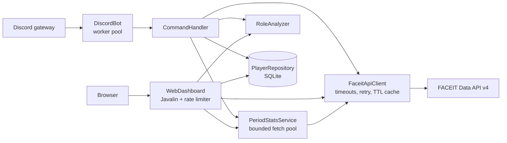

# Vitaly: CS2 Player Analytics (Discord Bot + Web Dashboard)


Vitaly turns raw FACEIT data into a readable scouting report for Counter-Strike 2 players.
It runs as two front ends on one Java process: a Discord bot for teams and communities, and a
single-page web dashboard. Both share one FACEIT client, one response cache and one SQLite leaderboard.

## What it does

| Feature | Discord | Web |
|---|---|---|
| Combat stats (K/D, ADR, HS%, win rate) | `!stats <nick>` | Search |
| Playstyle classification across 30 archetypes | `!role <nick>` | "Player DNA" tab |
| Best maps and auto-veto | `!maps <nick>` | Maps tab |
| Head-to-head comparison | `!compare <a> <b>` | Compare tab |
| Career highlights (aces, 4Ks, MVPs, streaks) | `!advanced <nick>` | Advanced tab |
| Stats for the last 30 / 90 / 180 / 365 days | `!period <nick>` or the menu under any result | Period selector |
| ELO leaderboard of scanned players | `!leaderboard` | Leaderboard tab |

## Architecture



`Main` is the composition root: it reads configuration once, builds each component once and injects
the same instances into both front ends.

## Engineering decisions worth reading

- **Never block the Discord gateway thread.** JDA dispatches events on one thread. Commands make
  blocking HTTP calls (a one-year period query can make 100+), so they run on a small worker pool and
  select-menu interactions are acknowledged inside Discord's 3-second window before the slow work starts.
- **Protecting a shared API quota.** Every public lookup costs several FACEIT calls. The client caches
  profiles for 5 minutes and match scoreboards for 24 hours (they never change), retries 429/5xx with
  backoff that honours `Retry-After`, and the web API rate-limits each client and caps concurrent
  period aggregations.
- **Time-window stats FACEIT doesn't provide.** FACEIT only exposes lifetime aggregates, so
  `PeriodStatsService` pages through match history and sums the player's line from each scoreboard,
  including every map of a best-of-three. Stats that only exist as lifetime totals (entry, clutch,
  utility) are labelled as such instead of being shown as zero.
- **Normalised role scoring.** Each archetype is a weighted blend of 0-100 sub-scores. "Higher is
  better" and "lower is better" terms are both expressed in the stat's own unit, so ADR, win rate and
  K/D contribute on the same scale.
- **Untrusted input everywhere.** Nicknames are validated and URL-encoded before they reach FACEIT,
  everything rendered in the dashboard is HTML-escaped, and Discord output is markdown-escaped.

## Testing

`mvn verify` runs 29 JUnit 5 tests, with no network access needed:

- The FACEIT client against an in-process fake API (URL encoding, retry on 429, caching, pagination, CS:GO fallback rules).
- The web API end to end on a random port (validation, 404/429 handling, period vs lifetime data, leaderboard writes).
- SQLite repository (upsert, case-insensitive de-duplication, concurrent writes).
- Role scoring and period aggregation, including regression tests for bugs fixed in this codebase.

GitHub Actions runs the same build on every push and pull request.

## Running it

Requirements: JDK 21 and Maven.

```bash
cp .env.example .env        # fill in FACEIT_API_KEY (and DISCORD_TOKEN for the bot)
mvn -B package
java -jar target/CS2Analyzer-1.0-SNAPSHOT.jar
```

Open http://localhost:8080. Without `DISCORD_TOKEN` the app runs the dashboard only.

| Variable | Required | Purpose |
|---|---|---|
| `FACEIT_API_KEY` | yes | [FACEIT Data API](https://developers.faceit.com/) key |
| `DISCORD_TOKEN` | no | Bot token; the bot needs the Message Content intent |
| `PORT` | no | HTTP port (default 8080) |
| `DB_PATH` | no | SQLite file (default `vitaly.db`; point it at a mounted volume in the cloud) |
| `TRUST_PROXY` | no | `true` behind a reverse proxy so rate limiting sees real client IPs |

### Deploying on Railway

Set the variables above, mount a volume and point `DB_PATH` at it (for example `/data/vitaly.db`),
set `TRUST_PROXY=true`, and use `/health` as the health check path.

## Tech stack

Java 21 · JDA 5 · Javalin 6 · Gson · SQLite (sqlite-jdbc) · Chart.js · JUnit 5 · GitHub Actions
